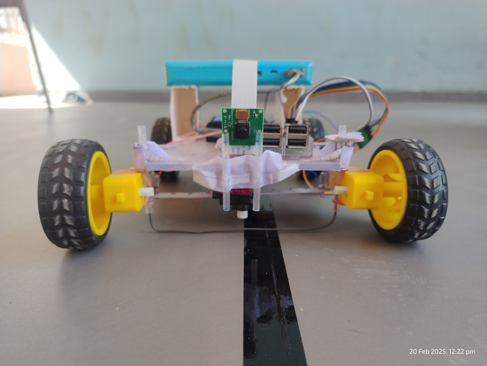
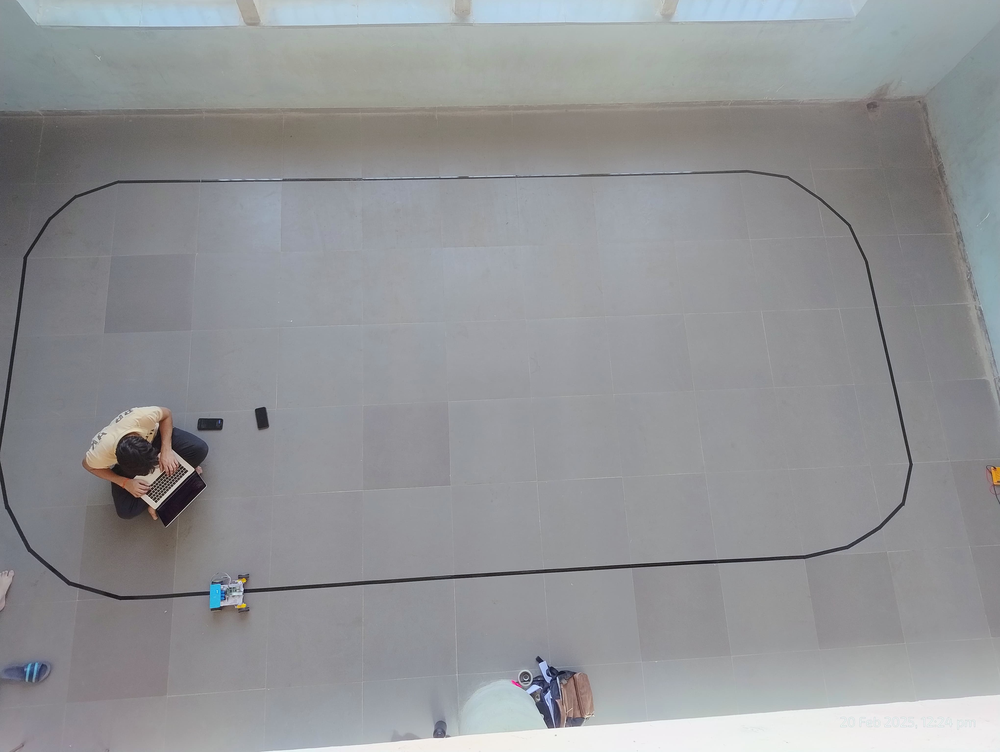

# Self-Driving Model Car using CNN & Raspberry Pi

This project showcases a miniature self-driving car built with a Raspberry Pi and a camera module that mimics real car steering using Ackermann geometry. The car drives autonomously by predicting steering angles from live camera images using a Convolutional Neural Network (CNN) trained on human driving data.

---

## 📌 Project Overview

The goal was to simulate the self-driving pipeline on a small-scale RC car:

1. **Ackermann Steering Implementation** to mimic real car steering behavior.
2. **Software Differential**: Adjusts wheel speeds on turns to mimic a differential (left/right wheels move at different speeds).
2. **Data Collection**: Manually driving the car on a custom track while collecting images and corresponding steering angles.
3. **Model Training**: A modified version of NVIDIA’s PilotNet CNN was trained using the collected data.
4. **Deployment**: Real-time inference performed on a laptop, with communication over a socket to the Raspberry Pi for control.

---

## 🛠️ Hardware Used

- **Raspberry Pi 3 B+**
- **Raspberry Pi Camera Module**
- **DC Motors + Ackermann Steering Mechanism**
- **Motor Driver Module**
- **Battery Pack**
- **Laptop (for inference and control logic)**
- **9g Metal Gear Servo**: Used for steering control.
- **All-Wheel Drive**: Motors on all four wheels to support realistic motion and turns.

---

## 🧠 Model Architecture

- **Framework**: Keras (with TensorFlow backend)
- **Base Architecture**: Modified NVIDIA PilotNet
- **Input Image Size**: `200 x 66`
- **Preprocessing**: Done on Raspberry Pi to reduce latency (cropping, resizing, normalization)
- **Output**: Predicted steering angle (single float value)

---

# 🛤️ Track



## 🧪 Data Collection

- Car was manually driven on a closed track.
- Both clockwise and anticlockwise runs were performed.
- 4000 raw images collected.
- **Label Format**: Steering angle encoded directly in the image filename
- After augmentation (flipping, brightness, shadow, etc.): **30,000+ images** used for training.

---

## 💻 Software Overview

- **Data collection** This script enables manual driving of the car using standard WASD keyboard inputs from a laptop via an SSH connection. This setup was also leveraged to collect driving data. To efficiently handle simultaneous tasks like receiving control inputs and managing data collection, the Python script utilizes multiprocessing.

- **Preprocessing and Model Training**: Images are croped and resized and converted to YUV frormat for model input

- **Model Training**: Used for running inference and controlling the car over socket.

- **Inference**: Raspberry pi click and preprocess the images for model input then sends it over a socket connection to my laptop for model inference then inferenced value is send back to car for turning

### 📂 Key Files

- `data_collection.py`: Captures images from the car’s front-facing camera and logs corresponding steering angles.
- `model.keras`: Modified version of NVIDIA’s PilotNet architecture.
- `Laptopserver.py`: Receives preprocessed images from the Pi, predicts steering angle, and sends it back.
- `pi_client.py`: Captures image → preprocesses → sends to laptop → receives steering → actuates motor.

---

<!-- ## 🧪 Data Collection

- Car was manually driven on a closed track.
- Both clockwise and anticlockwise runs were performed.
- **4000 raw images** collected.
- After augmentation (flipping, brightness, shadow, etc.): **30,000+ images** used for training.
- **Image Naming Format**:

Example file naming:  
```bash
image_00325_steer_-0.23.jpg -->